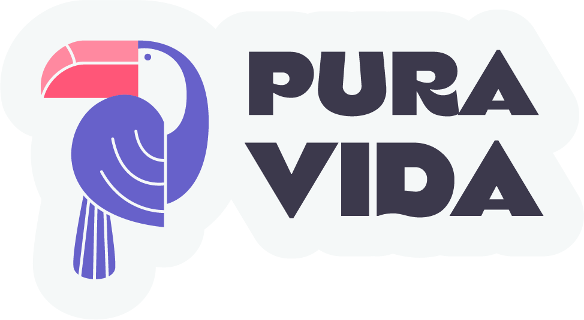

  

 

# TPO Codo a Codo 4.0 

**** • **Rocío Molina** • ****

 
 

## Tema: _**Sitio web de información turística**_ 

 

En el sitio se puede encontrar **destinos populares**, **lugares para visitar** de cada país, **actividades** y **alojamientos**. Además cuenta con la posibilidad de crear una cuenta.
Podras elegir entre los destinos mas populares como Estados Unidos,Corea del Sur ,Egipto y muchos mas. 

  
  
  
  

  

 ###### Sitios de referencia
  
 •  •   • 

  

**[Presentación](https://www.figma.com/proto/GTaeTxCWA45dwnvc24sk7h/Pura-Vida---Grupo-3---TP0?node-id=203%3A3&scaling=scale-down)** • **[Demo](https://codo-a-codo-grupo-3-viajes.vercel.app/)**

 
 

